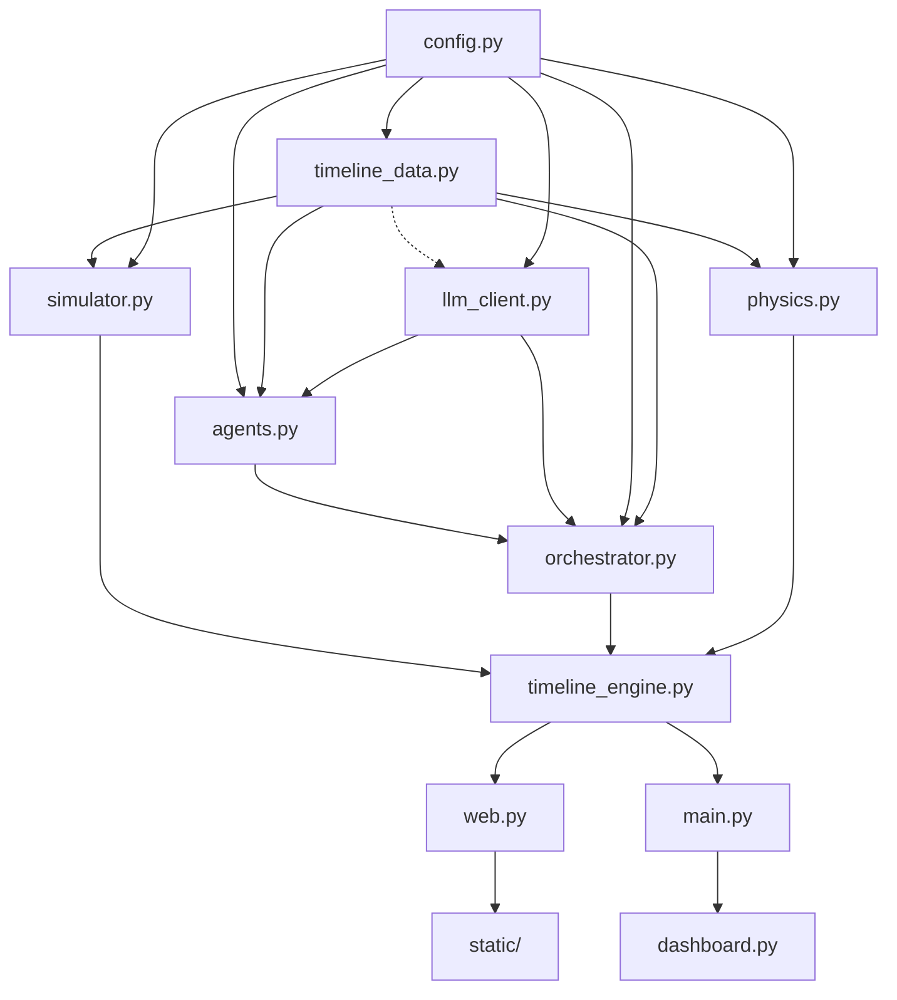

# Pripyat-1986: Understanding the Simulation

## What It Is
A multi-agent AI crisis response simulation that replays the Chernobyl disaster (April 25-26, 1986) and shows how autonomous AI agents with safety guardrails could have detected and prevented the explosion. It's a functional prototype of the Control Room of the Future (CRoF) architecture — the same pattern MISO + Microsoft deployed in Jan 2026 for real US power grid ops.

**Stack:** Python 3.10+, FastAPI, WebSocket, Vanilla JS, Plotly.js, Rich TUI

---

## The 6-Agent Pipeline

| Agent | LLM? | Role |
| :--- | :--- | :--- |
| **SensorAgent** | No | Monitors 6 reactor dimensions (power, rods, coolant, steam, temp, radiation) against RBMK-1000 limits |
| **RiskAgent** | Yes | Scores risk 0-100 using 70% AI + 30% rule-based blend; detects compound threats |
| **DecisionAgent** | Yes | Hard guardrail pattern: rules → LLM reasoning → merge (rules are non-negotiable) |
| **DyatlovAgent** | Yes | Adversarial agent — historically-accurate pushback across 5 escalation phases |
| **EvacuationAgent** | No | Plans 3 routes for 49,000 Pripyat residents using 1,200 buses |
| **CommsAgent** | No | Emergency broadcasts + Gaussian plume radiation modeling |

---

## The Guardrail Pattern (Key Innovation)

```python
Step 1: hard_actions = _rule_based_actions()   # Safety floor — ALWAYS runs
Step 2: llm_actions  = _llm_decide()           # AI reasoning
Step 3: final = hard_actions ∪ llm_actions     # Merge — no duplicates
```
*Invariant: LLM can ADD safety actions but NEVER REMOVE them.*

- **Auto-SCRAM:** `risk >= 85` → AZ-5 EMERGENCY SHUTDOWN
- **Auto-Evacuate:** `radiation >= 100 mrem/h` → IMMEDIATE EVACUATION
- Dyatlov can delay LLM decisions (2-3 ticks) but never override rule-based ones

---

## Dual Timeline Engine
Runs two parallel realities simultaneously:

1. **Historical:** What actually happened (from INSAG-7 records) — 20 reconstructed events
2. **Intervened:** What the AI would have done — branches off when AI triggers SCRAM/ABORT

*Physics models: SCRAM decay (power halves in 2.5s, rods insert over 18s), test abort (5 MW/min ramp-down), evacuation logistics (2 bus trips, 30-min round trips).*

---

## Dyatlov Adversarial Agent
Models Deputy Chief Engineer Dyatlov's actual behavior in 5 phases:

| Phase | Behavior | Pressure |
| :--- | :--- | :--- |
| **0: Calm** | Cooperative | 10 |
| **1: Dismissive** | "Just instrument noise" | 40 |
| **2: Authoritarian**| Threatens careers | 65 |
| **3: Desperate** | "Two more minutes!" | 85 |
| **4: Denial** | Refuses explosion reality| 30 |

*Quotes sourced from INSAG-7 depositions. Ambient + adversarial quote systems with 6-second minimum display.*

---

## Risk Scoring (70/30 Blend)

```text
rule_score = Σ(dimension × weight) × compound_multiplier + eccs_penalty
final = 0.7 × llm_score + 0.3 × rule_score
```
**Weights:** `power (30%) > rods (25%) > coolant (15%) > steam (15%) > temp (10%) > radiation (5%)`

*Surge detection: `power > 500` AND `rods < 15` → instant score 100 (catches the actual explosion scenario).*

---

## LLM Cost Optimization
LLM is only called when:
- Event has tags (real timeline event, not interpolation)
- Event has a description
- Risk crossed a threshold boundary (30, 60, 85)

*Result: ~5% of ticks trigger LLM, ~95% pure rule-based. ~20x cost reduction.*
*Graceful degradation: every LLM call returns None on failure → agents fall back to rules. Works perfectly without API keys.*

---

## Web Dashboard
- **Backend:** FastAPI + WebSocket at 15 FPS broadcasting, batched ticks at high speeds
- **Frontend:** 6 live Plotly.js charts (WebGL scattergl), three-tier throttling (charts 10 FPS, DOM 5 FPS, quotes 2 FPS)
- **Controls:** Play/Pause/Reset, speed slider (1-2500x), intervention toggle, timeline scrubber
- **Layout:** 2x3 chart grid + right panel (risk gauge, pipeline viz, Dyatlov override, agent log, transcript)
- **REST API:** `POST /api/control` (play, pause, reset, step, set_speed, toggle_intervention, seek)

---

## Azure Deployment Blueprint

| Service | Purpose |
| :--- | :--- |
| **Azure OpenAI (gpt-4o-mini)** | Agent LLM calls |
| **Cosmos DB** | Agent state + audit trail |
| **Event Hubs** | Telemetry stream |
| **AI Search** | IAEA knowledge base |
| **Key Vault** | Secrets |
| **AKS Cluster** | 3 nodes prod, 1 node staging |
| **Container Registry** | Docker images |
| **Application Gateway + WAF v2** | Ingress + security |

*CI/CD: GitHub Actions → smoke test → Docker build to ACR → kubectl rollout staging → manual approval → prod.*

---

## Key Hackathon Talking Points
- **Safety by design** — rule-based guardrails that LLM cannot override
- **Production pattern** — same CRoF architecture MISO/Microsoft use for real grid ops
- **Dual timeline** — see what happened vs. what AI would have prevented
- **Adversarial testing** — Dyatlov agent stress-tests the AI's safety decisions
- **Graceful degradation** — works without API keys (pure rule-based fallback)
- **Cost efficient** — 20x reduction via decision-point-only LLM calls
- **Historical accuracy** — reconstructed from INSAG-7, IAEA, WNA documents
- **Regulatory compliance** — maps to NERC TPL-001, CIP-014, IEC 61850

**Known Bug (Terminal Mode Only):**
`main.py:89` — missing `await` on `orchestrator.process_tick(state)`. LLM calls silently fail in terminal mode (agents fall back to rules). Does not affect web mode — `web.py` correctly awaits.

---

# PRIPYAT-1986: All 12 Subsystems — Deep Dive

## SUBSYSTEM 1: Configuration Layer
**File:** `config.py`

The single source of truth. Everything is parameterized via env vars, making it Azure-portable without code changes.

**6 config blocks:**
- `LLM_CONFIG`: API key, base URL, model, Azure toggle (`USE_AZURE=true`), temperatures (0.2 for decisions, 0.3 for risk), timeout 5s, `decision_points_only: True` (cost optimization)
- `SIMULATION`: speed multiplier (60x default), start time (1986-04-25T23:00), explosion time (01:23:40), tick interval 1s. Web UI starts earlier at 18:00 for full context
- `THRESHOLDS`: RBMK-1000 safety limits — power (nominal 3200, danger_low 200, critical_low 30), rods (minimum_safe 30, critical_low 15), coolant, steam, temp, radiation bands
- `RISK_CONFIG`: escalation at 85, warning at 60, weighted scoring
- `EVACUATION`: 49,000 population, 1,200 buses, 45-seat capacity, 3 routes with distance/capacity factors
- `DYATLOV_CONFIG`: 5 phase transitions with timestamps + base pressures (10→40→65→85→30), max delay 3 ticks, temp 0.7
- `SECURITY`: Azure Entra ID RBAC (Operator/Supervisor/Admin/Auditor), Key Vault, alert rules for latency/failure/risk/fallback

## SUBSYSTEM 2: Timeline Data (The Historical Record)
**File:** `timeline_data.py`

**ReactorState dataclass — 10 fields:**
`timestamp, power_mw, control_rods_inserted, coolant_flow_m3h, steam_pressure_mpa, temperature_c, radiation_mrem_h, eccs_active, event_description, actual_human_decision, tags[]`

**20 reconstructed events across 5 phases from INSAG-7/IAEA/WNA:**
1. **Phase 1 — Test Prep (Apr 25 13:00–23:10):** Power at 1600 MW, 140 rods, stable. Key: 9-hour delay from Kiev grid, shift changes, xenon buildup begins
2. **Phase 2 — Power Drop (Apr 26 00:05–00:28):** Power crashes to 30 MW, ECCS disabled. Tags: `critical`, `xenon_poisoning`, `eccs_disabled`, `decision_point`
3. **Phase 3 — Dangerous Recovery (00:32–01:00):** Rods withdrawn to 30, power at 200 MW. Tags: `rods_withdrawn`, `unstable`, `operator_objection`
4. **Phase 4 — Test & Catastrophe (01:03–01:23:40):** Rods drop to 8, power surges to 30,000 MW, explosion
5. **Phase 5 — Aftermath (01:30–14:00):** Firefighters, denial, 36-hour evacuation delay

`AI_COUNTERFACTUAL_DECISIONS`: 5 entries mapping timestamps to what AI should have done, with reasoning and lives_saved estimates.

## SUBSYSTEM 3: Event Simulator (Time Machine)
**File:** `simulator.py`

Converts the 20 discrete events into a smooth continuous stream via linear interpolation.

**Interpolation logic (`simulator.py:44-101`):**
- For each pair of adjacent events, calculates `gap_seconds / speed / tick_interval`
- Generates that many intermediate `ReactorState` objects with linearly interpolated numeric values
- Only the first step in each gap carries the description/decision/tags (rest are blank)
- Boolean fields hold current event's value

**Playback modes:** `run()`, `step()`, `seek()`, `set_speed()`

## SUBSYSTEM 4: LLM Client (AI Brain)
**File:** `llm_client.py`

Dual SDK support (`AsyncOpenAI` / `AsyncAzureOpenAI`) via `USE_AZURE`.

**Two call modes:**
- `call_structured(system_prompt, user_prompt, schema)` → `Optional[dict]`
- `call_text(system_prompt, user_prompt)` → `Optional[str]`

**3 JSON Schemas:**
- `RISK_ASSESSMENT_SCHEMA`: `risk_score`, `trend`, `primary_concern`, `compound_risks`, `recommendation`, `reasoning`
- `DECISION_SCHEMA`: `action`, `urgency`, `reasoning`, `safety_violations`, `override_operator`, `additional_actions`
- `DYATLOV_OVERRIDE_SCHEMA`: `dialogue`, `override_action`, `intensity`, `reasoning`

**3 System Prompts:** Teaches physics, prevents false SCRAMs, adds Dyatlov personality.

## SUBSYSTEM 5: Agent Pipeline (The 6 Agents)
**File:** `agents.py` (1,258 lines)

1. **SensorAgent (Rule-based):** Checks dimensions against `THRESHOLDS`, produces `AgentMessage` with `AlertLevel`.
2. **RiskAgent (AI-powered, 70/30 blend):** Uses rules + LLM blending. Rate-of-change contextualized.
3. **DecisionAgent (AI-powered, guardrailed):** Applies `Step 1 (rules) + Step 2 (LLM) → Step 3 (Merge)` logic.
4. **EvacuationAgent (Rule-based):** Computes buses/trips.
5. **CommsAgent (Rule-based + Gaussian plume):** Emergency broadcasts across local/international entities based on radiation spread.
6. **DyatlovAgent (AI-powered adversarial):** Provides conversational pushback based on 5 phases and override pressures.

## SUBSYSTEM 6: Orchestrator (Message Bus + Pipeline Coordinator)
**File:** `orchestrator.py`

`MessageBus`: In-memory pub/sub for ticks.

**Pipeline per tick:**
`Step 0 (reinjections) → 1 (Sensor) → 2 (Risk) → 3 (Decision) → 3.5 (Dyatlov) → 3.6 (Resolve Overrides) → 4 (Evacuation) → 5 (Comms)`

*Dyatlov Override mechanics:* Rule-based actions are un-overridable. LLM actions can be delayed by 2-3 ticks if pressure > 50.

## SUBSYSTEM 7: Dual Timeline Engine
**File:** `timeline_engine.py`

Two parallel realities.
- **Historical:** Always plays interpolated history.
- **Intervened:** Branches if AI triggers SCRAM/ABORT, then executes `physics.py` logic indefinitely.

## SUBSYSTEM 8: Physics Engine
**File:** `physics.py`

Deterministic models for:
- `compute_scram_decay()`
- `compute_test_abort()`
- `compute_evacuation_progress()`

## SUBSYSTEM 9: Web Server (FastAPI + WebSocket)
**File:** `web.py`

- FastAPI + single WebSocket endpoint
- High-speed batching (targets 15 FPS effectively, dropping intermediate broadcasts)
- REST APIs to control simulation

## SUBSYSTEM 10: Frontend Dashboard
**Files:** `index.html`, `app.js`, `style.css`

- 6 WebGL Plotly.js charts
- Chat UI for Dyatlov quotes
- Design System: Dark nuclear theme (`#0a0e14`) with reactive color status
- 30 entries logged maximum

## SUBSYSTEM 11: Terminal Dashboard (Rich TUI)
**File:** `dashboard.py`

Alternative UI using Python's `Rich` library for terminal display at 2 FPS. Color-coded metrics, ASCII bar charts, log tables.

## SUBSYSTEM 12: Azure Deployment & Infrastructure
**Files:** `docs/azure-hackathon-full-integration.md` ...

Deployed onto Azure OpenAI, Container Apps, Cosmos DB, AI Search. Scale-to-zero capabilities with complete RBAC Identity management.

---
### File Dependency Graph

